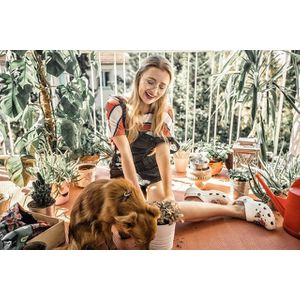
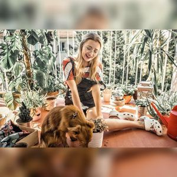

Image API is an essential tool to retrieve content from the Olapic Media Library without writing any complex code. By constructing your custom image URLs, you can retrieve content without having to write complex code that consumes the Olapic API. This URL can be used primarily in e-mail templates to increase brand engagement, social awareness of your brand, and ultimately conversion.

[Email Studio](https://olapic1.zendesk.com/hc/en-us/articles/360021855492) is a great tool to generate code snippets for your Email Campaigns. It uses Image API as the content source and allows you to display dynamic content in email marketing campaigns. Please consult the how-to guide for more details.

**This API is currently in BETA. It is is under developement and subject to any changes. Please consult your Olapic team before deploying on production.**

## Features
1. Retrieve content from Olapic Media Library without writing code (logic is all in the URL)
1. No need to set up a feed export / import for activating content in marketing channels
1. Did we mention there's no need to write code?
1. Advanced image manipulation: cropping, resizing, background support.

## API Endpoints

The base hostname for the BETA version of the API is currently: `kd9sq2whx8.execute-api.us-east-1.amazonaws.com/`.

You can access the root endpoint in the following route:
```
https://kd9sq2whx8.execute-api.us-east-1.amazonaws.com/pbox/customer/{customer_id}
```

### API Methods

| Method | URI                                          | Params                          | Description                                                                          |
| ------ | -------------------------------------------- | ------------------------------- | ------------------------------------------------------------------------------------ |
| `GET`  | `/pbox/customer/{customerId}/?{queryParams}` | `{customerId}`, `{queryParams}` | Returns a media using supplied params. See **Parameters** section below for details. |

The `{customer_id}` value can be found via the [root APIv2 endpoint](http://apiv2-docs.photorank.me/#header-root-endpoint).

The above path will be used for every call. All parameters specifying which image to retrieve will be set through the query string parameters (more info below).

## Getting Started with Image API

This API only returns rights-approved content from your Olapic Media Library.

In order to retrieve an image using Image API, you must construct the URL using parameter values that are specific to your system (i.e., Brand Product ID or SKU) or within Olapic platform (i.e., Olapic Stream ID).

## Parameters

These are the available query string parameters that you can customize to retrieve a desired image from your Olapic account:

| Parameter Name    | Description                                                                                                                                                                                                                                                                                                                                     |
| :---------------- | :---------------------------------------------------------------------------------------------------------------------------------------------------------------------------------------------------------------------------------------------------------------------------------------------------------------------------------------------- |
| `auth_token`      | `auth_token` is your Olapic account's API Key. The API key can be found on the settings page of the your Olapic account                                                                                                                                                                                                                         |
| `filter`          | The name of the filter you want to use in order to grab an image. This must be used in conjunction with `filter_value`                                                                                                                                                                                                                          |
| `filter_value`    | The value of the filter you want to apply in order to grab an image. If the filter is stream_id, the filter_value would be the actual id of the stream.                                                                                                                                                                                         |
| `sorting_options` | The method to sort the media returned by the API                                                                                                                                                                                                                                                                                                |
| `position`        | The position of the image within the api call that you would like to use. This is mostly useful if you'd like to use multiple images within your email campaign. This will tell us which image to surface in relation to that sorting option. In the case of a recent sorting option, a value of 1 will return the most recently uploaded image |
| `size`            | Image size of the media returned                                                                                                                                                                                                                                                                                                                |
| `fallback_image`  | Used to specify the fallback image in case no image is found using the parameters. This must be URI encoded.                                                                                                                                                                                                                                    |
| `crop_size`       | Crops the image. Size of the cropped image. Min/Max dimensions: 5x5 to 640x640                                                                                                                                                                                                                                                                  |
| `crop_fit`        | The fit of the cropped image. Available options: `contain`, and `cover`. [Emulates CSS3 `background-size` properties](https://developer.mozilla.org/en-US/docs/Web/CSS/background-size)                                                                                                                                                         |
| `crop_position`   | Used to define the center position of the cropped image. Available options: `center`, `attention`, and `entropy`.                                                                                                                                                                                                                               |
| `crop_background` | Defines the surrounding background of the cropped image. Used in junction with `crop_fit=contain`. Available options: HEX color values, or `blur`                                                                                                                                                                                               |

## Parameter Definitions

- `auth_token`

  - **Required:** Yes
  - **Description:** If only this parameter is present, then the API will return the latest rights approved image from your Olapic account.

- `filter`

  - **Required:** No
  - **Available Options:** `stream_id`, `product_id`, `category_id`, `user_id`, `media_id`
  - **Notes:** This parameter MUST be used in conjunction with the `filter_value` parameter

- `filter_value`

  - **Required:** No
  - **Description:** This parameter MUST be used in conjunction with the `filter` parameter

- `position`

  - **Required:** No
  - **Default value:** `0`
  - **Accepted value:** `0` to `19`
  - **Description:** Index position of the image you want to retrieve from the API. If you're looking to retrieve the most recent image, the value would be `0`. The second most recent image's position value would be `1`.

- `sorting_options`

  - **Required:** No
  - **Default value:** `recent`
  - **Available Options:** `recent`, `photorank`, `shuffled`, `rated`, `media_position`. For more information on each of the sorting options, please refer to this [link](http://apiv2-docs.photorank.me/index.html#header-media-sorting-options)

- `size`

  - **Required:** No
  - **Default value:** `normal`
  - **Available Options:** `square`, `thumbnail`, `mobile`, `normal`, `original`. For more information on each of the sizing options, please refer to this [link](http://apiv2-docs.photorank.me/index.html#header-media-sizing-options)
  - **Description:** The size of the image to be returned from the API

- `fallback_image`

  - **Required:** No
  - **Description:** The fallback image needs to be URI encoded, must be available via HTTP or HTTPS, and must end in an extension of `.jpg`, `.png`, `.jpeg`, or `.gif`
  - **Accepted value:** Any URL.

- `crop_size`

  - **Required:** No
  - **Description:** Crops the image. Size of the cropped image. Min/Max dimensions: 5x5 to 640x640
  - **Accepted value:** `{width}x{height}`. Example: `400x400`

- `crop_fit`

  - **Required:** No
  - **Description:** The fit of the cropped image.
  - **Available options:** `contain`, and `cover`. [Emulates CSS3 `background-size` properties](https://developer.mozilla.org/en-US/docs/Web/CSS/background-size)

- `crop_position`

  - **Required:** No
  - **Description:** Used to define the center position of the cropped image.
  - **Available options:** `center`, `attention`, and `entropy`.
    - `center`: focus on the center region of original image.
    - `entropy`: focus on the region with the highest [Shannon entropy](https://en.wikipedia.org/wiki/Entropy_%28information_theory%29).
    - `attention`: focus on the region with the highest luminance frequency, colour saturation and presence of skin tones.

- `crop_background`

  - **Required** No
  - **Description:** Defines the surrounding background of the cropped image. Used in junction with `crop_fit=contain`.
  - **Available options:**

    - HEX color values (all valid variations `#FFFFFF`, `FFFFFF`, `FFF`, `#FFF`)

      

    - this will produce a cropped image with the blurred background:

      